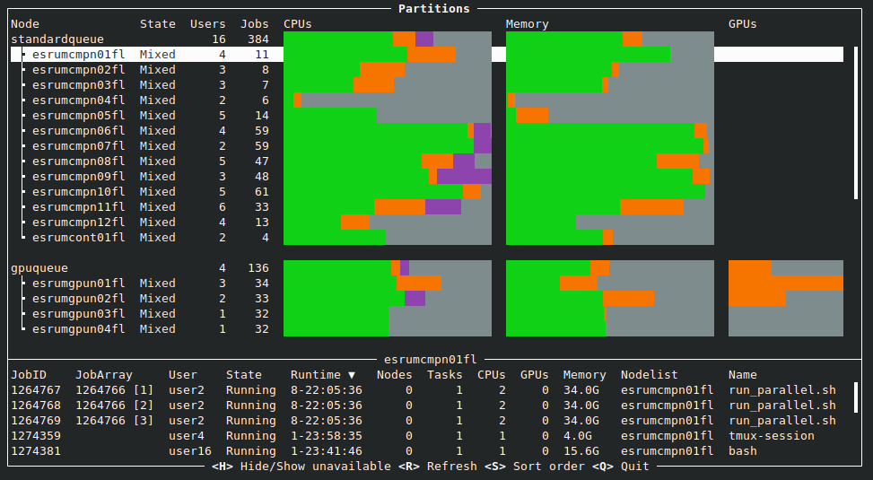

# Slurmboard

Slurmboard is a text-based dashboard for (smaller) Slurm clusters, intended to allow both end-users and administrators to monitor cluster utilization:



Slurmboard uses `sinfo` and `squeue` to query the state of Slurm, and therefore does not require any special setup or permissions to run.

## Installation

Slurmboard is built using Rust. Install Cargo, for example using [rustup](https://rustup.rs/), download and unpack the latest release, and then build a release-build:

```console
curl -Lo slurmboard-0.1.1.tar.gz https://github.com/cbmr-data/slurmboard/archive/refs/tags/v0.1.1.tar.gz
tar xvzf slurmboard-0.1.1.tar.gz
cd slurmboard-0.1.1
cargo build --release
target/release/slurmboard
```

The resulting binary (`target/release/slurmboard`) can be copied to a location in your PATH or executed in place.

## Resource bars

Slurmboard reports the following information per node and per partition, for CPUs, memory, and GPUs (if any nodes provide these), using a simple color scheme. The exact colors will depend on your theme.

- Green: Utilized memory or CPUs. This is based on the total node utilization reported by Slurm, and therefore mainly serves to reveal nodes that are underutilized relative to resource reservations. GPU utilization is not reported.
- Orange: Reserved but (potentially) unutilized resources.
- Purple: Resources that are not blocked for jobs using default resource allocations. I.e. if jobs would get 1 GB per CPU by default, then any CPU that would unable to reserve this amount of RAM would be marked as blocked.
- Grey: Unreserved resources.
- Black: Unavailable resources, due to a node being drained or otherwise unavailable.

## Controls

Slurmboard can be controlled by keyboard and (partly) by mouse.

|  Key             | Function                                      |
|------------------|-----------------------------------------------|
|  `h`             | Hide unavailable nodes (down, drained, etc.)  |
|  `r`             | Refresh (no more often than every 5 seconds)  |
|  Left/Right      | Change sort column                            |
|  `s`             | Change sort direction                         |
|  Tab             | Switch focus (nodes or tasks)                 |
|  `q` / `Ctrl+c`  | Quit                                          |

## Related tools

- [stui](https://github.com/mil-ad/stui)
- [turm](https://github.com/kabouzeid/turm) is a text-based user interface (TUI) for the Slurm Workload Manager, which provides a convenient way to manage your cluster jobs.
